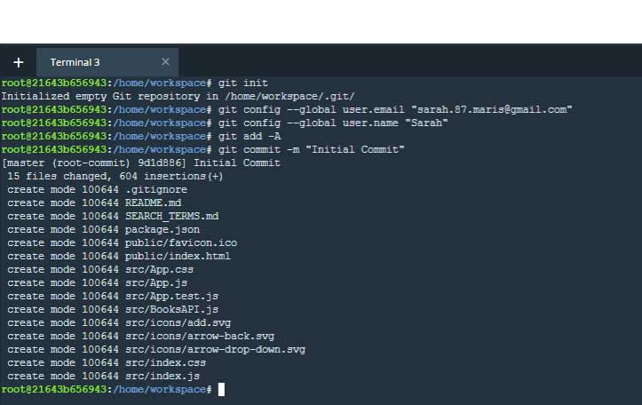
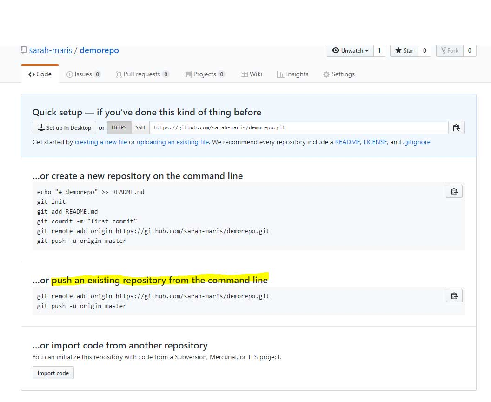
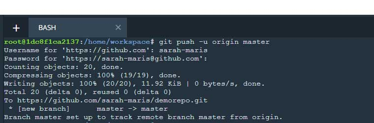

# Setting up a GitHub repo for a Project in the Udacity Workspace


This document should help you get a remote GitHub repository linked to your Udacity Workspace.  Please note that each Workspace will need its own repo.

##### I. [Instructions](#instructions)  
##### II.  [Troubleshooting](#troubleshooting)

---
## Instructions

### Start in Workspace

1. Initialize the git repo
```bash
git init
```

2. Configure your name and email
```bash
git config --global user.email "you@example.com"
git config --global user.name "Your Name"
```

3. Add and commit existing files:
```bash
git add -A
git commit -m "Initial Commit"
```
Your Workspace terminal should look something like this:


### Create a access personal token (your unique password)

! Update: Support for password authentication was removed on August 13, 2021
So, you will have to generate your own personal access token.

** You will have to keep it safe and secret. Each token you generate you can see it once!

(Requirement: You will have to confirm your e-mail account)

4. In the upper-right corner of any page, click your profile photo, then click Settings.

5. In the left sidebar, click Developer settings.

6. In the left sidebar, click Personal access tokens

7. Click Generate new token.

### Go to **[GitHub.com](https://github.com/)** and log in:

4. Create a new repository

5. Do _not_ check the "Initialize this repository with a README" radio button
   Create a new repository


6. On the next page, copy the code in the ***push an existing repository from the command line*** section:
&nbsp;  



### Go back to Workspace

7.  Paste in the terminal:
```bash
git remote add origin https://github.com/your-name/yourrepo.git
git push -u origin master
```

8.  Enter your GitHub username and password when prompted:


---

## Troubleshooting

### If there is already a git repo in the Workspace:
1. Go to the root of the project and delete the repo with this code:
```bash
rm -fr .git
```

2. Start over at [step 1](#instructions) above
